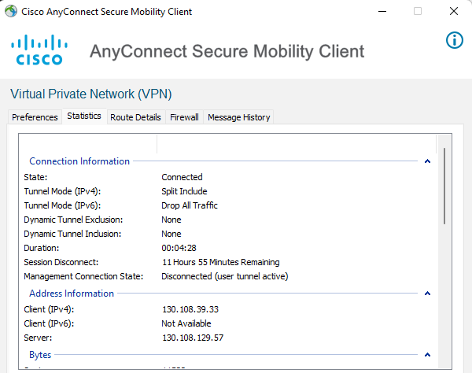
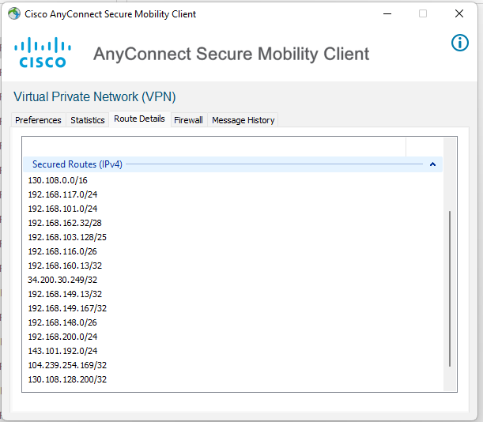
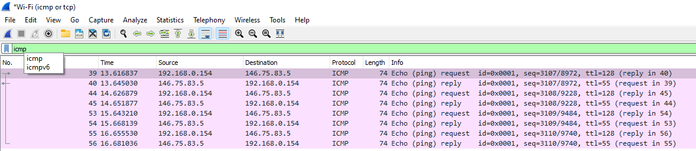
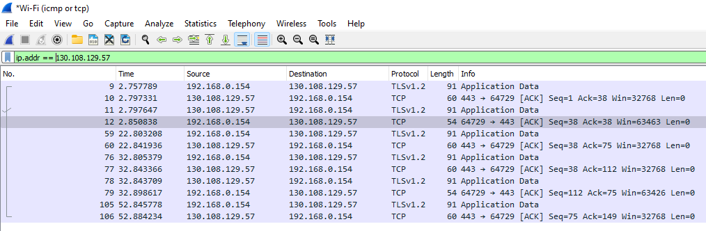
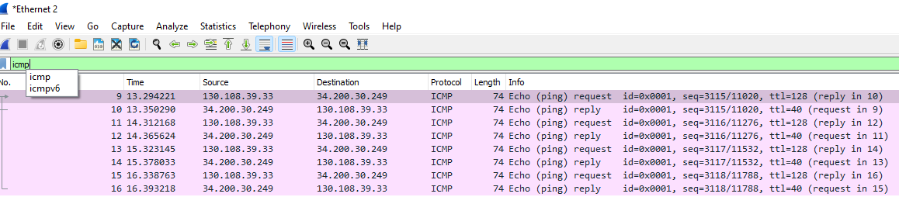

# Virtual Private Networks

A virtual private network (VPN) is to build a _virtual_ secure communication channel using insecure Internet to accomplish


+ Integrity
+ Confidentiality
+ Authenticity

---
## Two Types of VPNs Based on Their Development

+ Site to Site VPN
    + It is also known as LAN-to-LAN or Router-to-Router VPN. IPsec security method is used to create an encrypted tunnel from one customer network to remote site of the customer. Multiple users are not allowed in Site-to-Site VPN.
+ Remote Access VPN
    + Individual users are connected to the private network and It allows the technique to access the services and resources of that private network remotely. In remote access VPN, multiple users are allowed.

---


---

# VPN Protocols

+ IPSec
+ SSL/TLS
+ L2TP
+ PPTP (not recommended)
+ ......

---
## IPSec VPN

IPSec VPN is site-to-site VPN. 


[A good example of IPSec VPN can be found here from Youtube](https://www.youtube.com/watch?v=CuxyZiSCSfc)

---
## IPSec VPN
Two Phases

+ Phase 1: Router A and B negotiate policies. 
+ Phase 2: Router A and B transfer data. 


[A good example of IPSec VPN can be found here from Youtube](https://www.youtube.com/watch?v=C_B9k0l6kEs)

---
## IPSec VPN

+ Phase 1 is to negotiate IPSec Security Associations (SAs)
    + Cryptography suites to be used
    + Their parameters

 

---
## SSL VPN

+ Why remote-access VPN is needed? 
    + You do not have control of the router (e.g, a hotel router) that gives you access to Internet. 

+ SSL VPN is remote-access VPN.

+ One example is your Cisco Anyconnect


---

## SSL VPN - An Architectural Overview


---
## A very important step for SSL VPN

+ Client Address Pool: The SSL VPN gateway has a configurable address pool that is used to allocate IP addresses to remote VPN clients.

+ The client will get a virtual IP address assigned. When this client visit any service inside the destination private network or visit other service through the destination private network, it is going to use its assigned IP. 

+ [A good example of IPSec VPN can be found here from Youtube starting at 31:00](https://www.youtube.com/watch?v=bV0g32Nmum8)

---

## My AnyConnect Client



+ I am running this client while I am at home with a private IP (192.168.0.154).
+ See the assigned IP from the VPN server?
    + ``130.108.39.33``, it is a WSU IP!
+ The Tunnel Mode is ``Split Include``
    + Only selected traffic goes through VPN.
    + ``Tunnel All Traffic`` tunnels all!
---


## My AnyConnect Client

+ What traffic will be tunneled then? 
+ Using IP ranges
    + 130.108.0.0/16 -> the campus
    + 34.200.30.249/32 -> an amazon IP
    + A few private IP ranges!
        + you will actually get replies if you ping them (i.e., ping ``ping 192.168.117.1``)



---

## My AnyConnect Client

+ There is also a list of *Non-Secured Routes (IPv4)*. 

+ Can you find it? 

---

## My AnyConnect Client

With my AnyConnect Client active, I ping 146.75.83.5 (www.cnn.com, not tunnel) and 34.200.30.249 (tunneled). 

```console
C:\Users\junji>ping www.cnn.com
Pinging cnn-tls.map.fastly.net [146.75.83.5] with 32 bytes of data:
Reply from 146.75.83.5: bytes=32 time=28ms TTL=55
Reply from 146.75.83.5: bytes=32 time=25ms TTL=55

C:\Users\junji>ping 34.200.30.249
Pinging 34.200.30.249 with 32 bytes of data:
Reply from 34.200.30.249: bytes=32 time=55ms TTL=40
Reply from 34.200.30.249: bytes=32 time=54ms TTL=40
```

---
## My AnyConnect Client

Both ``ping`` tests should generate ICMP packets. Right? However, if you capture traffic on the WiFi interface, you will only see ICMP queries and replies with 146.75.83.5. 



---
## My AnyConnect Client

So where are ICMP packets for 34.200.30.249? 
+ They are tunneled through the VPN server 130.108.129.57 using SSL/TLS. 
+ These ICMPs are encrypted and they are invisible to you on WiFi interface (and therefore on the Internet). 



---
## My AnyConnect Client

If you want to see packets before your AnyConnect encapsulate them or after the VPN server decapsulate them, you can caputre packets from the VPN's interface. When I run this example, it is with Ethernet2. 




---

## My AnyConnect Client

```console
C:\Users\junji>ping 130.108.73.76

Pinging 130.108.73.76 with 32 bytes of data:
Request timed out.
```
Will you see these ICMP packets in plaintext through the WiFi interface? 

+ Yes since 130.108.73.76 is on the *Non-Secured Routes*. 
+ So packets exchanged with this IP will not go through the VPN server. 

